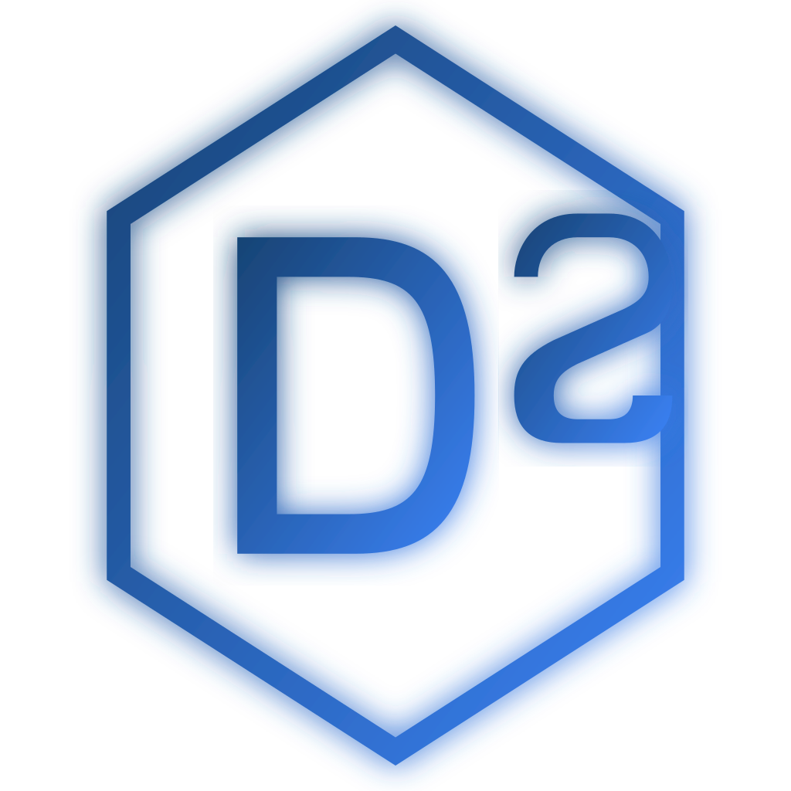

# DigitalSolutions Logo Dateien

Dieser Ordner enthält alle verfügbaren Logo-Varianten für DigitalSolutions.

## 📁 Verfügbare Dateien

### SVG-Dateien (Vektorgrafiken)
SVG-Dateien sind skalierbar ohne Qualitätsverlust und ideal für:
- Webseiten
- Druck in beliebiger Größe
- Professionelle Dokumente

| Datei | Größe | Beschreibung | Verwendung |
|-------|-------|--------------|------------|
| `logo.svg` | 100×100px | Standard-Logo transparent | Webseite, dunkler Hintergrund |
| `logo-highres.svg` | 512×512px | Hochauflösende Version transparent | Professioneller Druck, große Formate |
| `logo-white-bg.svg` | 512×512px | Mit weißem Hintergrund | Dokumente, Präsentationen |

### PNG-Dateien (Rastergrafiken)
PNG-Dateien sind ideal für:
- Rechnungen und Geschäftsdokumente
- E-Mail-Signaturen
- Social Media Profile

| Datei | Größe | Beschreibung | Verwendung |
|-------|-------|--------------|------------|
| `logo.png` | 512×512px | Standard-Logo transparent | Allgemeine Verwendung |
| `logo-highres.png` | 1024×1024px | Hochauflösend transparent | Druck, hochwertige Darstellung |
| `logo-white-bg.png` | 1024×1024px | Mit weißem Hintergrund | **Ideal für Rechnungen** |

## 🎨 Design-Informationen

### Farben
- **Primärfarbe (Dunkelblau)**: `rgb(23, 67, 116)` / `#174374`
- **Sekundärfarbe (Hellblau)**: `rgb(59, 130, 246)` / `#3B82F6`
- **Gradient**: Von Dunkelblau zu Hellblau (diagonal)

### Elemente
- Sechseck (Hexagon) als äußerer Rahmen
- Buchstaben "D" und "S" für DigitalSolutions
- Subtiler Glow-Effekt für moderne Optik

## 📄 Verwendung in Rechnungen

Für Rechnungen empfehlen wir:
1. **Am besten**: `logo-white-bg.png` (1024×1024px)
   - Weißer Hintergrund
   - Hohe Auflösung
   - Druckfertig

2. **Alternative**: `logo-white-bg.svg`
   - Unbegrenzt skalierbar
   - Perfekt für PDF-Generierung
   - Kleinere Dateigröße

### Einbindung in Rechnungsvorlagen

#### HTML/PDF
```html

```

#### Word/LibreOffice
1. Datei öffnen
2. Einfügen → Bild
3. `logo-white-bg.png` auswählen
4. Größe anpassen (empfohlen: 3-5cm Breite)

#### Excel/LibreOffice Calc
1. Einfügen → Bild
2. `logo-white-bg.png` auswählen
3. In Kopfzeile/obere Ecke positionieren

## 🔄 Logo neu generieren

Falls Sie das Logo ändern müssen, verwenden Sie:

```bash
# Logo-Komponente bearbeiten
nano components/ui/Logo.tsx

# SVG-Dateien aktualisieren (Script passt sich automatisch an)
node scripts/convert-logo.js
```

## 📐 Empfohlene Größen

### Webseite
- Header: 40-60px
- Footer: 30-40px
- Favicon: 32×32px (bereits vorhanden als favicon.svg)

### Druckmaterialien
- Visitenkarten: 2-3cm
- Briefpapier: 3-5cm
- Flyer/Broschüren: 5-8cm
- Plakate: 10-20cm

### Digital
- E-Mail-Signatur: 80-120px
- Social Media Profilbild: 400×400px
- Website-Thumbnail: 200×200px

## 🌐 Online-Zugriff

Die Logo-Dateien sind auch über die Webseite verfügbar:

- https://digitalssolutions.com/logo.svg
- https://digitalssolutions.com/logo.png
- https://digitalssolutions.com/logo-white-bg.png

## 💡 Tipps

1. **Für Rechnungen**: Verwenden Sie immer `logo-white-bg.png` für beste Kompatibilität
2. **Für Web**: Verwenden Sie SVG-Dateien für scharfe Darstellung auf allen Bildschirmgrößen
3. **Für Druck**: Verwenden Sie die hochauflösenden Varianten (1024×1024px oder SVG)
4. **Für Social Media**: `logo-white-bg.png` ist ideal für Profile mit weißem/hellem Hintergrund

## 📧 Kontakt

Bei Fragen zum Logo oder für weitere Varianten:
- E-Mail: contact@digitalssolutions.com
- Tel: +49 179 6627473
